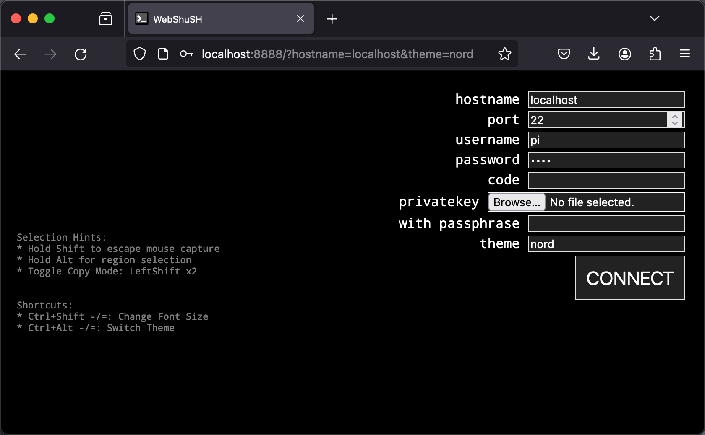
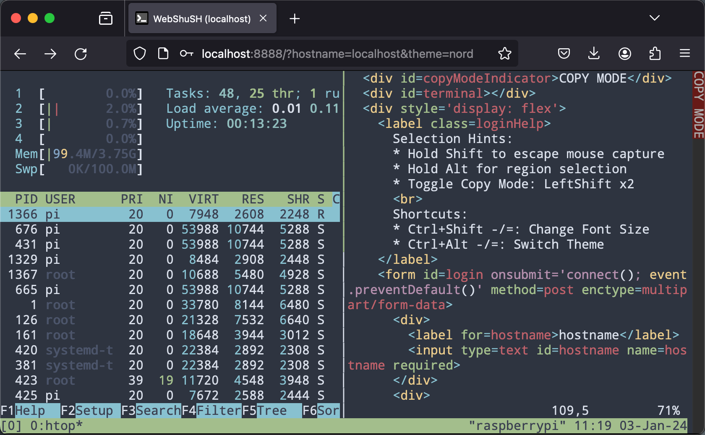

# WebShuSH

A whisper thin SSH client for the browser.


Login screen:


Connected terminal:


This is a simple web application to be used as an ssh client to connect to your ssh servers. This was forked from WebSSH with a reworked frontend.

## Features

* SSH password authentication supported, including empty password.
* SSH public-key authentication supported, including DSA RSA ECDSA Ed25519 keys.
* Encrypted keys supported.
* Two-Factor Authentication (time-based one-time codes) supported.
* Fullscreen terminal.
* Terminal window resizable.
* Modern browsers including Chrome, Firefox, Safari, Edge, Opera supported.

### Features beyond WebSSH (as of v1.6.2 - April 2023)

 * Updated to xterm.js 5.3.0.
 * Staggeringly faster interactivity, especially with truecolor.
 * Support changing font size while connected to terminal.
 * Support changing theme while connected to terminal.
 * Added all the themes from Alacritty (over 100).
 * Default theme switched to Alacritty's default theme.
 * Allow theme selection to be included in the URL parameters.
 * Added Copy Mode allowing Copy/Paste shortcuts on Linux and Windows.
 * Support for region select and forced selection on Macs.
 * Disable most browser based keyboard shortcuts for better TUI support.
 * Allow hostname to be provided in the URL without username (bugfix).
 * Redesigned login screen with a terminal theme.
 * User interface hints included in login screen.
 * Added Noto Mono Nerd Font as the default, and only font.
 * Rebranded as WebShuSH due to major redirection (upstream pull of anything is welcome)
 * Switched to UTF-8 encoding support, only.
 * Removed support for specifying each individual color in the URL.
 * Removed bootstrap, popper, and jquery dependencies.
 * Javascript dependencies managed by npm.
 * Switched terminal resizing logic to xterm.js' fitAddon.
 * Simpler frontend codebase.
 * Enchanced security with removal of a reflected XSS vulnerability.

## How it works
```
+---------+     http     +--------+    ssh    +-----------+
| browser | <==========> | webssh | <=======> | ssh server|
+---------+   websocket  +--------+    ssh    +-----------+
```

It is written in Python and javscript, based on tornado, paramiko and xterm.js.

## Requirements

* Python 3.8+


## Quickstart

1. Clone this repo.
2. Install dependencies with `pip install -r requirements.txt && npm ci`
2. Start a webserver with `python run.py`
3. Open your browser, navigate to `127.0.0.1:8888`
4. Login, and connect.

## Server Options

```bash
# start a http server with specified listen address and listen port
wssh --address='2.2.2.2' --port=8000

# start a https server, certfile and keyfile must be passed
wssh --certfile='/path/to/cert.crt' --keyfile='/path/to/cert.key'

# missing host key policy
wssh --policy=reject

# logging level
wssh --logging=debug

# log to file
wssh --log-file-prefix=main.log

# more options
wssh --help
```

## URL Arguments

All login screen options can be provided as URL parameters. E.g:

```
http://localhost:8888/?hostname=localhost&theme=nord
```

## Tests

Install Requirements
```
pip install pytest pytest-cov codecov flake8 mock
```

Run all tests
```
python -m pytest tests
```

## Deployment

### Docker

Start up the app
```
docker-compose up
```

Tear down the app
```
docker-compose down
```

### Nginx

Running behind an Nginx server

```bash
wssh --address='127.0.0.1' --port=8888 --policy=reject
```
```nginx
# Nginx config example
location / {
    proxy_pass http://127.0.0.1:8888;
    proxy_http_version 1.1;
    proxy_read_timeout 300;
    proxy_set_header Upgrade $http_upgrade;
    proxy_set_header Connection "upgrade";
    proxy_set_header Host $http_host;
    proxy_set_header X-Real-IP $remote_addr;
    proxy_set_header X-Real-PORT $remote_port;
}
```

Running as a standalone server
```bash
wssh --port=8080 --sslport=4433 --certfile='cert.crt' --keyfile='cert.key' --xheaders=False --policy=reject
```

# Important Security Notice

* For whatever deployment choice you choose, don't forget to enable SSL.
* This is essential to avoid exposing credentials over an unencrypted channel.
* By default plain http requests from a public network will be either redirected or blocked and being redirected takes precedence over being blocked.
* Try to use reject policy as the missing host key policy along with your verified known_hosts, this will prevent man-in-the-middle attacks. The idea is that it checks the system host keys file("~/.ssh/known_hosts") and the application host keys file("./known_hosts") in order, if the ssh server's hostname is not found or the key is not matched, the connection will be aborted.
